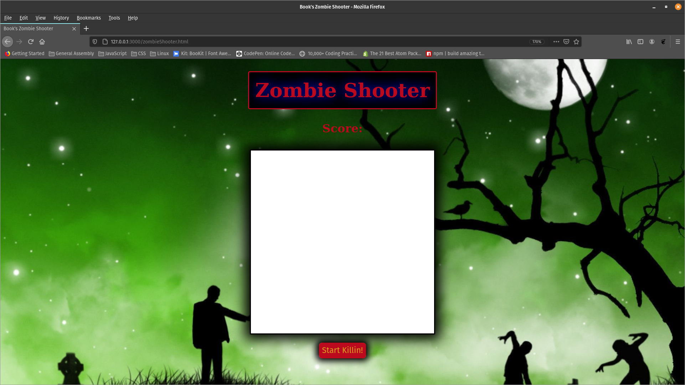
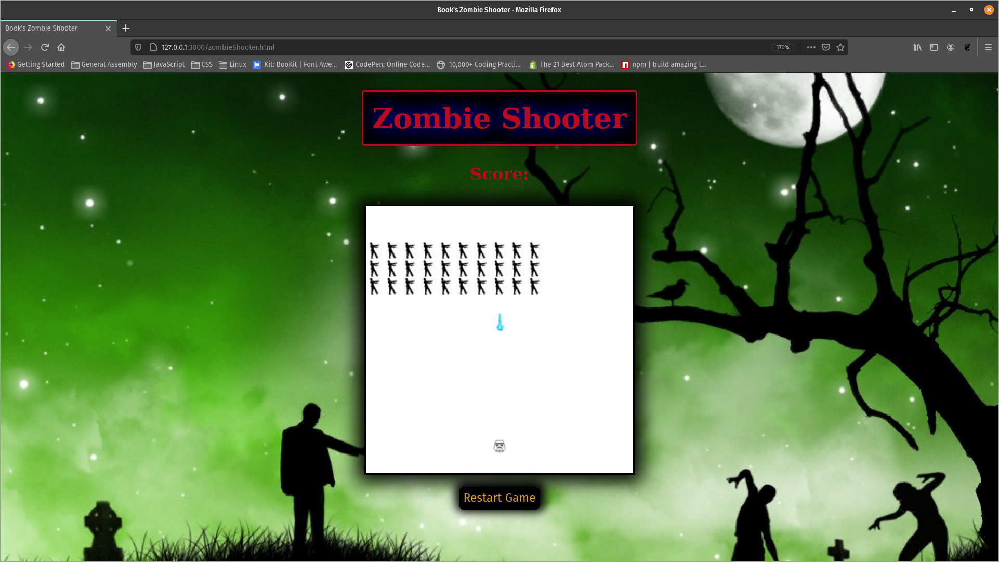

#  README: Zombie Invaders

### How to Play
Begin by clicking the 'Start Killin' button. Once clicked, the game will begin. You are in a Halloween costume dressed as a store trooper. Hopefully your aim is better... The goal is to kill all the zombies before they reach you. There are 30 total.
Move your character by using the left and right arrow keys and shoot with the space bar. When the game is over, you are more than welcome to kill them all again by clicking the restart button.
---
### Motivation
Space Invaders was the first game I ever played as a child. I remember seeing an arcade machine of it in a corner store and while I was not really playing because I did not insert any money to do so, I definitely thought I was playing -- smashing buttons and snapping the joystick around.
Making this game gave me an opportunity to put into use switch statements and all that I learned about loops. I also dynamically generated all the HTML.

#### Wireframe and Screenshots

* [Wireframe](./images/spaceInvadersWireframe.odg)

---
### Technologies & Code Snippets
Major JS Features Include: loop, eventListeners, createElement, classList, querySelector, setInterval, and switch case.

---
### Credits

Kubowania's space-invader's gitHub https://github.com/kubowania/space-invaders was a major help with planning of the logic. Structuring it all to work under the conditions that I wanted was a challenge but having a foundation to work upon was definitely useful.

Other's that contributed include classmates: Devin (code for restart function), Ted (overall critique of project), and Danny (help with grid).

---

### Future development
The next stage of this is to add levels that get progressively more challenging. I want to make the zombies move more independently as well or in groups when they can split off as a challenge to the user.
I might also add in different weapons for the user to blast the zombies with.
